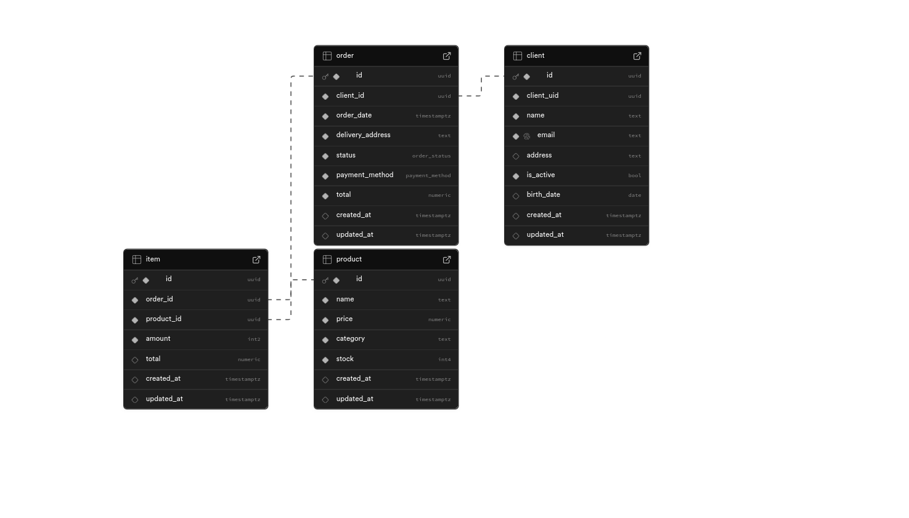

# EscriboJrTest

O objetivo do projeto é desenvolver um sistema de e-commerce com tabelas para gerenciar clientes, produtos e pedidos, **com controle de acesso usando Row Level Security (RLS) no Supabase**.

## Como rodar localmente

**requistos**: docker e supabase instalados na maquina

1 -

```bash
git clone https://github.com/VitorCesarinoMarchese/EscriboJrTest.git
```

2 -

```bash
cd EscriboJrTest
```

3 -

```bash
npm i
```

4 -

```bash
npx supabase start
```

5 -

```bash
npx functions serve
```

## Schema



## Tabelas

### Client

| Campo          | Tipo          | Descrição                                                                                                                                                          |
| -------------- | ------------- | ------------------------------------------------------------------------------------------------------------------------------------------------------------------ |
| **id**         | `uuid`        | Identificador único do cliente (chave primária). Usando UUID para garantir unicidade global, maior segurança e facilidade de integração com sistemas distribuídos. |
| **client_uid** | `uuid`        | Relaciona o cliente ao usuário do Supabase Auth. Essencial para RLS: permite que cada usuário acesse apenas seus próprios registros.                               |
| **name**       | `text`        | Nome completo do cliente.                                                                                                                                          |
| **email**      | `text`        | Endereço de e-mail do cliente (deve ser único no sistema).                                                                                                         |
| **address**    | `text`        | Endereço físico ou principal do cliente.                                                                                                                           |
| **is_active**  | `boolean`     | Indica se o cliente está ativo na plataforma.                                                                                                                      |
| **birth_date** | `date`        | Data de nascimento do cliente.                                                                                                                                     |
| **created_at** | `timestamptz` | Data e hora em que o registro do cliente foi criado.                                                                                                               |
| **updated_at** | `timestamptz` | Data e hora da última atualização das informações do cliente.                                                                                                      |

### Order

| Campo                | Tipo                                  | Descrição                                                                                  |
| -------------------- | ------------------------------------- | ------------------------------------------------------------------------------------------ |
| **id**               | `uuid`                                | Identificador único do pedido (chave primária).                                            |
| **client_id**        | `uuid`                                | Identificador único do cliente que realizou o pedido (chave estrangeira para `client.id`). |
| **order_date**       | `timestamptz`                         | Data e hora em que o pedido foi realizado.                                                 |
| **delivery_address** | `text`                                | Endereço de entrega selecionado para o pedido.                                             |
| **status**           | `order_status` _(enum customizado)_   | Estado atual do pedido.                                                                    |
| **payment_method**   | `payment_method` _(enum customizado)_ | Método de pagamento utilizado.                                                             |
| **total**            | `numeric(10,2)`                       | Valor total do pedido.                                                                     |
| **created_at**       | `timestamptz`                         | Data e hora de criação do registro.                                                        |
| **updated_at**       | `timestamptz`                         | Data e hora da última atualização.                                                         |

### Product

| Campo          | Tipo            | Descrição                                        |
| -------------- | --------------- | ------------------------------------------------ |
| **id**         | `uuid`          | Identificador único do produto (chave primária). |
| **name**       | `text`          | Nome do produto.                                 |
| **price**      | `numeric(10,2)` | Preço do produto.                                |
| **category**   | `text`          | Categoria do produto.                            |
| **stock**      | `integer`       | Quantidade disponível em estoque.                |
| **created_at** | `timestamptz`   | Data e hora de criação do registro do produto.   |
| **updated_at** | `timestamptz`   | Data e hora da última atualização do produto.    |

### Item

| Campo          | Tipo            | Descrição                                                                            |
| -------------- | --------------- | ------------------------------------------------------------------------------------ |
| **id**         | `uuid`          | Identificador único do item do pedido (chave primária).                              |
| **order_id**   | `uuid`          | Referência ao pedido ao qual este item pertence (chave estrangeira para `order.id`). |
| **product_id** | `uuid`          | Referência ao produto deste item (chave estrangeira para `product.id`).              |
| **amount**     | `smallint`      | Quantidade de unidades deste produto no pedido.                                      |
| **total**      | `numeric(10,2)` | Valor total deste item (`amount * preço do produto`).                                |
| **created_at** | `timestamptz`   | Data e hora de criação do registro do item.                                          |
| **updated_at** | `timestamptz`   | Data e hora da última atualização do item.                                           |

---

## Políticas de segurança implementadas e templates

Este projeto utiliza Row Level Security (RLS) no Supabase para restringir acesso aos dados com base no usuário autenticado. Abaixo estão as políticas principais já utilizadas/esperadas e exemplos de SQL para aplicar políticas comuns.

Observação: nas policies do Supabase/Postgres, `auth.uid()` é usado para comparar o JWT sub/uid do usuário autenticado.

- Client — cada usuário só pode ler/alterar seus próprios dados

```sql
CREATE POLICY "clients_user_is_owner" ON client
  FOR SELECT USING (client_uid = auth.uid());

CREATE POLICY "clients_user_can_insert" ON client
  FOR INSERT WITH CHECK (client_uid = auth.uid());

CREATE POLICY "clients_user_can_update" ON client
  FOR UPDATE USING (client_uid = auth.uid());

CREATE POLICY "clients_user_can_delete" ON client
  FOR DELETE USING (client_uid = auth.uid());
```

- Order — usuários podem acessar pedidos relacionados ao seu cliente

```sql
CREATE POLICY "orders_user_is_owner" ON "order"
  FOR SELECT USING (client_id IN (SELECT id FROM client WHERE client_uid = auth.uid()));

CREATE POLICY "orders_user_can_insert" ON "order"
  FOR INSERT WITH CHECK (client_id IN (SELECT id FROM client WHERE client_uid = auth.uid()));

CREATE POLICY "orders_user_can_update" ON "order"
  FOR UPDATE USING (client_id IN (SELECT id FROM client WHERE client_uid = auth.uid()));
```

- Item — restrição similar à de pedidos (vincular ao pedido/cliente)

```sql
CREATE POLICY "item_user_is_owner" ON item
  FOR SELECT
  USING (
    order_id IN (
      SELECT id FROM "order"
      WHERE client_id IN (
        SELECT id FROM client WHERE client_uid = auth.uid()
      )
    )
  );

CREATE POLICY "item_user_can_insert" ON item
  FOR INSERT
  WITH CHECK (
    order_id IN (
      SELECT id FROM "order"
      WHERE client_id IN (
        SELECT id FROM client WHERE client_uid = auth.uid()
      )
    )
  );

CREATE POLICY "item_user_can_update" ON item
  FOR UPDATE
  USING (
    order_id IN (
      SELECT id FROM "order"
      WHERE client_id IN (
        SELECT id FROM client WHERE client_uid = auth.uid()
      )
    )
  );
```

- Product — leitura pública, escrita apenas por administradores

```sql
CREATE POLICY "Enable insert for service_role only" ON product
  FOR ALL
  USING (auth.role() = 'service_role')
  WITH CHECK (auth.role() = 'service_role');

CREATE POLICY "Enable read access for all users" ON product
  FOR SELECT
  USING (true);
```

---

## Edge Functions — uso e endpoints

Funções encontradas no repositório:

1. emailConfirmation

- Propósito: Recebe um payload com `orderId`, busca os dados do pedido no banco e envia um e-mail de confirmação usando resend.
- Regras/observações:
  - Implementada para verificar `content-type: application/json` e body com `{ "orderId": "<uuid>" }`.
  - Internamente usa um cliente Supabase criado com `SUPABASE_SERVICE_ROLE_KEY` (ou seja, executa com privilégios de serviço para ler os dados).
- Invocação (local)

```bash
curl -i --location --request POST '<http://127.0.0.1:54321/functions/v1/emailConfirmation>' \\
  -H 'Content-Type: application/json' \\
  -H 'Authorization: Bearer <USER_JWT_OR_SERVICE_ROLE>' \\
  --data-raw '{"orderId":"<ORDER_UUID>"}'

```

- Invocação via supabase-js (client)

```tsx
const res = await supabase.functions.invoke("emailConfirmation", {
  method: "POST",
  body: JSON.stringify({ orderId: "<ORDER_UUID>" }),
});
```

2. exportOrderToCSV

- Propósito: Exporta pedidos/itens/cliente em CSV e retorna como `text/csv` com header `Content-Disposition: attachment; filename=orders.csv`.
- Regras/observações:
  - Faz leitura de uma order do banco.
  - Retorna um csv.
- Invocação (local)

```bash
 curl -i --location --request POST 'http://127.0.0.1:54321/functions/v1/exportOrderToCSV' \
           --header 'Authorization: Bearer <USER_JWT_OR_SERVICE_ROLE>' \
           --header 'Content-Type: application/json' \
           --data '{"orderId":"<ORDER_UUID>"}'
```

- Invocação via supabase-js (client)

```tsx
const res = await supabase.functions.invoke("exportOrderToCSV", {
  method: "POST",
  body: JSON.stringify({ orderId: "<ORDER_UUID>" }),
});
```

URLs de produção / deploy

- Local (CLI): <http://127.0.0.1:54321/functions/v1/><functionName>
- Deploy no Supabase (padrão): https://<project>.functions.supabase.co/<functionName>
  - O path pode ser `https://<project>.functions.supabase.co/<functionName>` ou similar. Verifique no dashboard do projeto o endpoint final após o deploy.

Cabeças importantes de segurança e configuração

- `verify_jwt = true` exige que o cliente envie `Authorization: Bearer <JWT>` com um token válido do Supabase Auth.
- Se a função precisa executar ações privilegiadas no banco, ela pode criar um cliente Supabase com a `SUPABASE_SERVICE_ROLE_KEY`.
